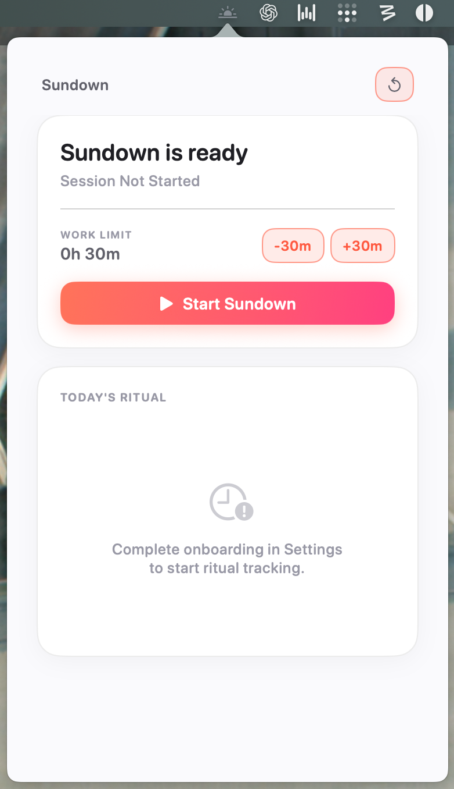
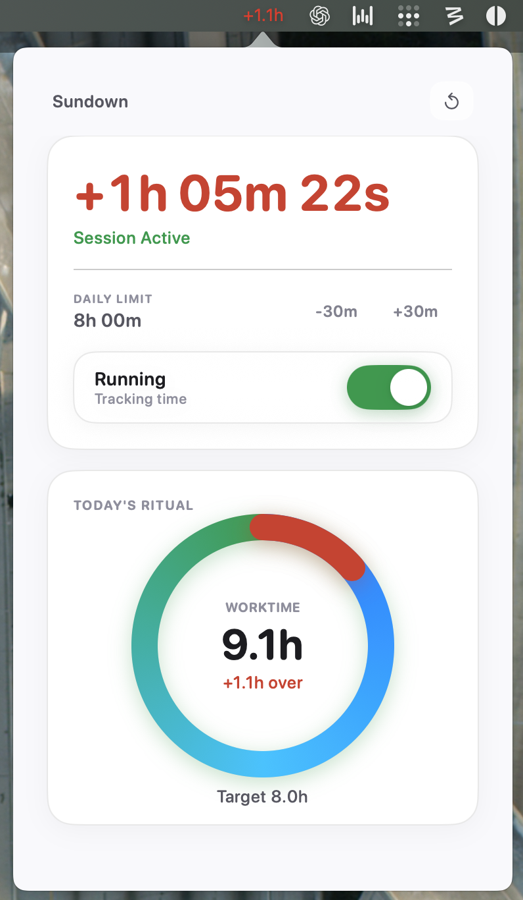

# Sundown

Lightweight macOS menubar app for keeping a daily worktime boundary.

> Homebrew-ready release automation is now included in this repo.

<p align="center">
  
  
</p>

## Install

### Homebrew

```bash
brew tap seilk/sundown
brew install --cask sundown
```

Note: `seilk/homebrew-sundown` tap repository must exist and include `Casks/sundown.rb`.

### Build from source

```bash
swift run SundownApp
```

## Usage

- Left click menubar icon: open dashboard.
- Right click menubar icon: open settings or quit.
- Start session, pause/resume with toggle, reset when needed.

## Validate

```bash
swift test
swift build
```

## Release for Homebrew

On tag push, GitHub Actions now:

1. runs tests,
2. builds and bundles `Sundown.app`,
3. signs with Developer ID, notarizes, and staples the app,
4. calculates SHA-256,
5. generates `dist/homebrew/Casks/sundown.rb`,
6. uploads both files to the GitHub Release.

Required GitHub secrets for release signing/notarization:

- `APPLE_SIGN_IDENTITY`
- `APPLE_ID`
- `APPLE_TEAM_ID`
- `APPLE_APP_SPECIFIC_PASSWORD`

Workflow file: `.github/workflows/release-homebrew.yml`

Tap source template: `homebrew/Casks/sundown.rb.template`

Local dry-run commands:

```bash
bash scripts/package-macos-app.sh 1.0.0
bash scripts/render-homebrew-cask.sh 1.0.0 <sha256-from-previous-step>
```

## Docs

- `docs/PRD.md`
- `docs/ARCHITECTURE.md`
- `docs/ROADMAP.md`
